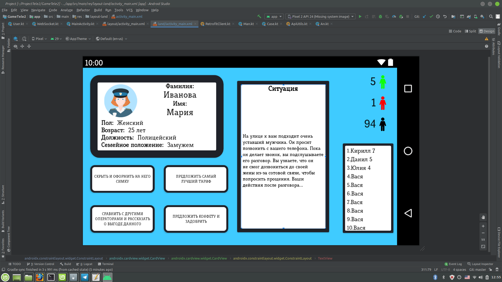

# client-server-game-application-

Приложение было создано для хакатона.Ссылку на код могу отправить лично Вам.

Показательное видео  работы приложения по ссылке - https://www.youtube.com/watch?v=xhLEw19zyH4

О приложении:
Наше приложение может нести как развлекательный характер, так и учебный и вспомогательный. Человек заходит в игру и начинает соревноваться с другими игроками за звание "лучшего маркетолога". Основная цель игры это набрать большее количество очков, нежели твои соперники. Это достигается тем, что вам нужно выбрать правильную стратегию и как можно быстрее уговаривать отдельно взятых людей в определенных нестандартных для вас ситуациях на покупку симки. Кейсы могут быть персональными и меняться в зависимости от внешних условий ( например донат ). Это может помочь маркетологам прокачать свои знания либо же проверить навыки собеседуемого вами маркетолога. Баллы, полученные игроками, полностью интегрируемы в любую платформы по-средством API. Наше приложение может помочь вам завлечь больше опытных маркетологов, посредством игрового формата. Благодаря вирусности данного формата игроки будут долго в нее играть, а смотря на количество побед и поражений можно выявить лучших. У нас используется самописная база моделей, где сохранются баллы, информация о пользователе и прочее. Это обеспечивает высокую скорость получения данных и надежность.Работа с сетью реализована с помощью Retrofit2.
